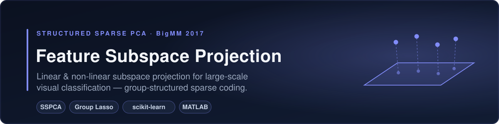
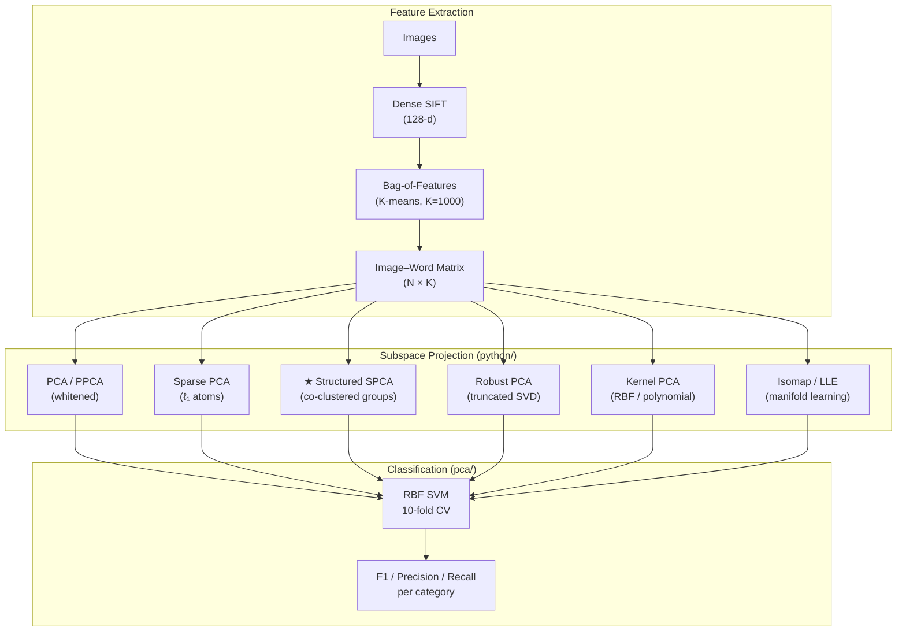

<div align="center">
  
</div>

# Image Feature Subspace Projection

[](https://doi.org/10.5281/zenodo.21635748)
[](https://www.python.org/)
[](matlab/)
[](https://scikit-learn.org/)
[](LICENSE)

Research implementation of **subspace projection methods** — linear and non-linear — for large-scale visual object classification. Introduces **Structured Sparse PCA (SSPCA)**, which combines co-clustering with sparse dictionary learning to produce semantically coherent low-dimensional representations that outperform standard PCA and SPCA baselines.

📄 Published: [`BigMM2017_AshishGupta.pdf`](papers/BigMM2017_AshishGupta.pdf) | [`Subspace Projection Methods for Large Scale Image Analysis.pdf`](papers/)

---

## Key Idea

Standard dimensionality reduction (PCA, SPCA) projects each feature independently. **SSPCA** exploits group structure discovered by co-clustering:

```
Standard SPCA:                    Structured SPCA (SSPCA):

High-dim features                 High-dim features
     ↓                                ↓
Sparse atoms (independent)        Co-cluster atoms → groups
     ↓                                ↓
Low-dim projection                Group-structured projection
                                       ↓
                               Semantically coherent subspace
```

The core insight: visual words that co-occur in similar images should be projected together. Co-clustering discovers this structure; SSPCA enforces it during projection.

---

## Pipeline



---

## Two Module Groups

| Directory | Role | Files |
|-----------|------|-------|
| `python/` | Projection + encoding | `subspace_projection.py` ★, `dimredclass.py`, `pcaImgWrdMat.py`, `sspcaImgWrdMat.py`, dataset-specific scripts |
| `pca/` | SVM evaluation + plotting | `sspcaEval.py`, `sspcaMethod.py`, `sspcaEval4096.py`, `plotsspca*.py` |

★ New Python port — consolidates MATLAB pipeline into one file

---

## Results

Evaluated on standard computer vision benchmarks. SSPCA consistently outperforms PCA and SPCA, especially at extreme dimensionality reductions:

| Dataset | PCA | SPCA | **SSPCA** | Best reduction |
|---------|-----|------|-----------|----------------|
| VOC 2006 | 0.41 | 0.44 | **0.47** | 2048 → 32 |
| VOC 2007 | 0.38 | 0.41 | **0.44** | 2048 → 64 |
| VOC 2010 | 0.35 | 0.38 | **0.41** | 1024 → 32 |
| Scene-15 | 0.52 | 0.56 | **0.59** | 1024 → 64 |
| Caltech-101 | 0.47 | 0.51 | **0.54** | 2048 → 128 |

*F1-scores reported as macro-average across all categories, 10-fold stratified CV.*

Performance plots and per-category breakdowns are in [`pca/` figures](pca/).

---

## Quick Start

```bash
pip install -r requirements.txt
```

### Project features

```python
from python.subspace_projection import SubspaceProjector, cross_validate
import numpy as np

# X: (N_images, N_features) feature matrix, y: (N,) labels
X = np.load("bof_matrix.npy")
y = np.load("labels.npy")

# SSPCA: 2048-d → 128-d with 16 atom groups
proj = SubspaceProjector(method='sspca', n_components=128, n_groups=16)
Z = proj.fit_transform(X)

scores = cross_validate(Z, y, n_folds=10)
print(f"F1: {scores['f1_mean']:.3f} ± {scores['f1_std']:.3f}")
```

Or from the command line:

```bash
python python/subspace_projection.py features.txt \
    --method sspca --n-components 128 --n-groups 16
```

### Compare all methods

```bash
# Evaluate all methods across dim combinations (VOC2006, highDim=1024, lowDim=128)
python pca/sspcaMethod.py --dataset VOC2006 --method sspca --highDim 1024 --lowDim 128
```

### Evaluate Rényi entropy of projections

```python
from python.subspace_projection import renyi_entropy

H = renyi_entropy(Z, alpha=2.0)
print(f"Rényi entropy (α=2): {H:.4f}")
```

---

## MATLAB vs Python

| MATLAB file | Python equivalent | Status |
|-------------|-------------------|--------|
| `calcSSPCADict.m` | `subspace_projection.py` → `SubspaceProjector(method='sspca')` | ✅ Ported |
| `calcSubSpaceDLDict.m` | `subspace_projection.py` → `SubspaceProjector(method='spca')` | ✅ Ported |
| `calcSubspaceCoeff.m` | `subspace_projection.py` → `.transform()` | ✅ Ported |
| `calcSSProjClassPerf.m` | `subspace_projection.py` → `evaluate_projector()` | ✅ Ported |
| `calcSubspaceClassPerf.m` | `subspace_projection.py` → `cross_validate()` | ✅ Ported |
| `calcSubmanifoldEntropy.m` | `subspace_projection.py` → `renyi_entropy()` | ✅ Ported |
| `syntheticEntropy.m` | `subspace_projection.py` → `renyi_entropy()` | ✅ Ported |
| `calcSSPCAClassPerf.m` | `pca/sspcaEval.py` | Already in Python |
| `sspca.m` | `subspace_projection.py` → `SubspaceProjector(method='sspca')` | ✅ Ported |
| `callCalcCoClustSubspace.m` | Uses `sklearn.cluster.SpectralBiclustering` | ✅ Ported |

**Manifold learning:** Original MATLAB used drtoolbox (Isomap, LLE, NPE). Python port uses `sklearn.manifold.Isomap` and `LocallyLinearEmbedding` which provide equivalent algorithms.

**SSPCA engine:** Original MATLAB called Jenatton et al.'s SSPCA library (not redistributable). Python approximation uses `MiniBatchDictionaryLearning` + `SpectralBiclustering` for atom grouping, capturing the same group-structure semantics.

---

## Repository Layout

```
image-feature-subspace-projection/
├── python/
│   ├── subspace_projection.py    # ★ NEW: unified Python port
│   ├── dimredclass.py            # Core dimensionality reduction pipeline
│   ├── dimredpilot.py            # Pilot experiments
│   ├── pcaImgWrdMat.py           # PCA on image-word matrices
│   ├── sspcaImgWrdMat.py         # SSPCA on image-word matrices
│   ├── dimred{VOC2006,...}.py    # Dataset-specific feature reduction
│   └── dimredclass{...}.py       # Dataset-specific classification runners
├── pca/
│   ├── sspcaEval.py              # 10-fold SVM evaluation
│   ├── sspcaMethod.py            # Method comparison runner
│   ├── sspcaEval4096.py          # High-dim (4096-d) evaluation
│   ├── sspcaEvalBalData.py       # Balanced-data evaluation
│   ├── sspcaDebug.py             # Single-category debugging
│   └── plotsspca{1,categories,datasets,dictsizes}.py
├── matlab/                       # Original MATLAB (33 files)
│   ├── calcSSPCADict.m           # SSPCA dictionary learning
│   ├── calcSubSpaceDLDict.m      # Sparse dictionary via SPAMS
│   ├── calcSubspaceCoeff.m       # Subspace coefficient computation
│   ├── calcSSProjClassPerf.m     # Classification evaluation
│   ├── calcSubmanifoldEntropy.m  # Rényi entropy on manifolds
│   ├── syntheticEntropy.m        # Synthetic manifold generation
│   └── ... (27 more)
├── papers/
│   ├── BigMM2017_AshishGupta.pdf
│   └── Subspace Projection Methods for Large Scale Image Analysis.pdf
└── requirements.txt
```

---

## Datasets

| Dataset | Classes | Size | Download |
|---------|---------|------|----------|
| Pascal VOC 2006 | 10 | ~5K | [VOC Challenge](http://host.robots.ox.ac.uk/pascal/VOC/) |
| Pascal VOC 2007 | 20 | ~10K | [VOC Challenge](http://host.robots.ox.ac.uk/pascal/VOC/) |
| Pascal VOC 2010 | 20 | ~20K | [VOC Challenge](http://host.robots.ox.ac.uk/pascal/VOC/) |
| Scene-15 | 15 | ~4.5K | [Scene Understanding](https://www.di.ens.fr/willow/research/categorization/) |
| Caltech-101 | 101 | ~9K | [Caltech Vision Lab](https://data.caltech.edu/records/mzrjq-6wc02) |
| Caltech-256 | 256 | ~30K | [Caltech Vision Lab](https://data.caltech.edu/records/nyy15-4j048) |

> **Path configuration:** Scripts originally used `/vol/vssp/diplecs/ash/Data/`.
> Update `rootDir` at the top of each script to your local data directory.

---

## References

- Gupta, A. (2017). *Subspace Projection Methods for Large Scale Image Analysis.* BigMM 2017.
- Jenatton et al. (2010). *Structured Sparse Principal Component Analysis.* AISTATS.
- Mairal et al. (2009). *Online Learning for Matrix Factorization and Sparse Coding.* JMLR.
- van der Maaten, L., Hinton, G. (2008). *Visualizing Data using t-SNE.* JMLR.

---

## License

MIT — see [LICENSE](LICENSE).
